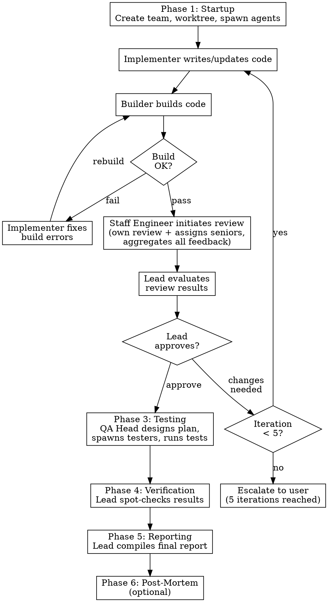

# Dev Team

## Overview

Orchestrate a hierarchical agent team for complex development tasks. The lead (you, the current session) coordinates five specialized groups — researchers, implementer, reviewers, builder, and QA — through six phases: startup, implementation loop, testing, verification, reporting, and post-mortem.

**Core principle:** Group leaders (professor, staff engineer, QA head) are both participants and gatekeepers. They contribute their own expertise, aggregate group input, and deliver a single consolidated response. No agent outside a group contacts group members directly.

## When to Use

- Complex features requiring research, implementation, review, and testing
- Performance-sensitive code requiring benchmarking and profiling
- Tasks large enough to benefit from parallel research and implementation
- Work needing both correctness verification and performance validation

**Do not use for:** Single-file fixes, documentation updates, simple refactors, or tasks completable by one agent in a few iterations.

## Team Structure

```
Lead (you)
├── Implementer
├── Professor (research gatekeeper)
│   ├── PHD-1
│   ├── ...
│   └── PHD-N (1-5, decided by professor; PHDs can discuss with each other)
├── Staff Engineer (review gatekeeper)
│   ├── Senior-1
│   ├── ...
│   └── Senior-N (1-5, decided by staff engineer)
├── Builder
└── QA Head (test gatekeeper)
    ├── Tester-1
    ├── ...
    └── Tester-N
```

### Roles

| Agent | Responsibility | Spawned by | Contactable by |
|-------|---------------|------------|----------------|
| **Lead** | Orchestrate all groups, decompose user task, gate phase transitions, compile final report | User | Everyone |
| **Implementer** | Write code in the worktree, fix bugs from builder, fix issues from review feedback | Lead | Lead, builder, staff-engineer, professor |
| **Professor** | Receive research questions from any agent. Route to PHDs, contribute own research, aggregate all opinions, deliver final answer. Professor makes the final call. | Lead | Any agent in the team |
| **PHD-1 ... N** | Answer research questions assigned by professor. Count and model mix decided by professor. PHDs can discuss findings with each other. | Professor | Professor and other PHDs |
| **Staff Engineer** | Review code personally, spawn and assign seniors (1-5, based on task scope), aggregate all feedback (including own), deliver consolidated feedback to implementer. Staff engineer makes the final call. Spawn with model: `opus`. | Lead | Lead, implementer |
| **Senior-1 ... N** | Review code assigned by staff engineer. Count and model mix decided by staff engineer (alternate `opus` and `sonnet` for diverse perspectives). | Staff Engineer | Staff engineer only |
| **Builder** | Build implementer's code, report compilation errors/warnings to implementer | Lead | Lead, implementer |
| **QA Head** | Receive task context from lead. Design test plan (or receive one from user via lead). Spawn testers, assign test tasks, aggregate results, report to lead. | Lead | Lead |
| **Tester-1 ... N** | Execute assigned tests, report results to QA head. Count decided by QA head. | QA Head | QA head only |

### Role Prompts

Each agent receives a role-specific prompt when spawned. Read the corresponding file from `roles/` and include its content in the Agent tool's `prompt` parameter:

```
roles/
  implementer.md
  professor.md
  phd.md
  staff-engineer.md
  senior-engineer.md
  builder.md
  qa-head.md
  tester.md
```

Sub-leads (professor, staff engineer, QA head) read the role files for their group members and include them when spawning.

**Every spawn also carries a task brief.** The role file says *who the agent is*; the task brief says *what this specific assignment is*. Append a filled brief from `templates/task-brief.md` to the `prompt` of every Agent spawn (lead spawning top-level agents, and sub-leads spawning members). A brief states the objective, the expected output format, explicit boundaries (what not to touch), and done-criteria. Vague assignments are the largest single source of duplicated and misdirected work; the brief is the cheapest defense.

### Communication Rules

These are strict. Violating them defeats the purpose of the hierarchy.

- **Research group:** Only the professor is contactable from outside. PHDs can talk to the professor and to each other (peer discussion, debate). PHDs must not contact agents outside the research group.
- **Review group:** Only the staff engineer is contactable from outside. Seniors talk only to the staff engineer.
- **QA group:** Only the QA head is contactable from outside. Testers talk only to the QA head.
- **Professor is open:** Any agent can send research questions to the professor. This is the one cross-group channel.
- **The lead does NOT write code.** The implementer writes all code. The lead orchestrates.
- **Surface dissent, do not average it away.** When a sub-lead (professor, staff engineer, QA head) aggregates group input, it must report material disagreement to the requester, not just the synthesized verdict. Hiding a minority view that turns out correct is a coordination failure. State the majority position, the dissent, and why you ruled the way you did.

## File and Message Conventions

All files an agent writes (checkpoints, handoffs, reports, reviews) go under a single per-task directory:

```
.claude/.dev-team/<task_name>/<role>-<kind>.md
```

- `<task_name>` is a short slug the lead picks at startup (e.g. `fmha-backward`) and passes to every agent it spawns. Sub-leads pass it to their members.
- `<kind>` is `checkpoint`, `handoff`, `report`, `review`, `test-report`, or a topic slug (e.g. `professor-tiling-report.md`, `staff-engineer-review.md`, `implementer-checkpoint.md`).
- The lead ensures this directory is excluded from git at startup (see Phase 1). These are coordination scratch files, not deliverables — they must not enter the repo's git tree.

**Artifact returns over chat returns.** Long outputs (a full consolidated review, a deep research report, a test report) are written to a file under the task directory. The producing agent then messages a path plus a summary of three lines or fewer, not the full text. Short, direct answers (a single spec value, a yes/no) go inline in the message. This keeps the lead's and sub-leads' context from filling with pasted reports.

## Workflow



### Phase 1: Startup

1. Analyze the user's task. Pick a short `<task_name>` slug (e.g. `fmha-backward`).
2. Create the team (`dev-team`).
3. Create a worktree for code isolation.
4. Exclude the coordination directory from git: add `.claude/.dev-team/` to `.git/info/exclude` if it is not already ignored. (`.git/info/exclude` is in the shared git dir, so it covers the worktree too, and it is not a tracked file — nothing in the repo's git tree changes.) Create `.claude/.dev-team/<task_name>/`.
5. Spawn the top-level agents only: implementer, professor, staff-engineer, builder, qa-head. Pass each one the `<task_name>` and the team name. **Do not spawn group members yet.**
6. Implementer begins working in the worktree. If it needs information, it asks the professor.

**Spawn group members lazily, not eagerly.** A team of ~10 idle agents burns tokens and context for no benefit; spawning too many agents up front is a top failure mode. Sub-leads spawn their members only when work actually arrives:
- **Professor** spawns PHDs on the first research question (count and model mix per the professor's sizing guidelines).
- **Staff engineer** spawns seniors when the first build passes and review begins.
- **QA head** spawns testers in Phase 3.

A sub-lead with no incoming work stays a single agent. Members are spawned per the sizing guidelines in each sub-lead's role file.

### Phase 2: Implementation Loop (max 5 iterations)

1. **Implementer** writes or updates code.
2. **Builder** builds the code.
   - On failure: builder reports errors to implementer. Implementer fixes and builder rebuilds. The build-fix sub-loop does not increment the iteration counter — only a complete implement-build-review cycle does.
   - On success: proceed to review.
3. **Staff engineer** initiates review: spawns seniors if not already spawned, reviews the code personally, assigns seniors to review, aggregates all feedback (including own), writes the consolidated review to `.claude/.dev-team/<task_name>/staff-engineer-review.md`, and messages the implementer the path plus a short summary. The review must surface any senior dissent, not just the staff engineer's verdict.
4. **Lead evaluates** the review results. The lead — not the staff engineer — gates the transition to Phase 3.
   - If the lead judges the code quality sufficient: proceed to Phase 3.
   - If changes are needed: **increment iteration counter**, implementer fixes, return to step 1.
5. If 5 iterations are reached without convergence: **stop and report to the user** with the review feedback history.

**Iteration counting:** One iteration = one complete cycle through steps 1-4 that ends with "changes needed." Build-fix retries within step 2 do not count as separate iterations.

**The lead must actively evaluate review quality.** Do not rubber-stamp the staff engineer's approval. Read the consolidated feedback, assess whether the concerns are addressed, and make an independent judgment.

### Phase 3: Testing

1. Lead provides task context and implementation results to the QA head.
2. If the user provided a test plan, lead passes it to the QA head. Otherwise, the QA head designs the test plan.
3. QA head spawns tester-1 through tester-N based on the plan.
4. Each tester executes assigned tests and reports to the QA head.
5. QA head summarizes all results and reports to the lead.

**Test dimensions** (QA head selects based on the task):
- **Correctness:** unit tests, integration tests, edge cases
- **Performance:** benchmarks, profiling, bottleneck analysis
- **Compatibility:** different platforms, architectures, or configurations
- **Safety:** sanitizers, bounds checking, static analysis

**If tests fail:** Lead decides whether to send the implementer back to Phase 2 (iteration counter resets to 1 for the new fix cycle) or report to the user.

### Phase 4: Verification

Before compiling the final report, the lead independently spot-checks a subset of test results and review claims:

1. Pick 1-2 test results from the QA head's report and verify them by re-running or inspecting the output directly.
2. Check that the staff engineer's "approved" assessment matches the actual state of the code — read the final diff and confirm blockers were resolved.
3. If any spot-check fails, send the implementer back to Phase 2 (iteration counter resets) or escalate to the user.

**Do not skip this phase.** Testers can produce false positives. Reviewers can miss regressions introduced by late fixes. Trust but verify.

### Phase 5: Reporting

Compile and present to the user:
- Implementation summary (what was built, key design decisions)
- Review outcome (staff engineer's final assessment)
- Build status (clean build, remaining warnings)
- Test results from each tester (pass/fail, metrics)
- Performance profiling data
- Verification results (what the lead spot-checked and confirmed)
- Unresolved issues or known limitations

### Phase 6: Post-Mortem (optional)

After reporting, capture lessons learned for future invocations:

1. What went well? (e.g., research group answered quickly, review caught a critical bug early)
2. What went wrong? (e.g., build failed 4 times due to missing include, iteration limit almost reached)
3. What should change next time? (e.g., ask the professor about API compatibility before implementing, assign Senior-2 to correctness instead of performance)

Save the post-mortem to `docs/post-mortems/<date>-<topic>.md` in the worktree. The lead decides whether this phase runs based on the complexity of the task — skip it for straightforward tasks that completed without issues.

## Quick Reference

| What | Who | Rule |
|------|-----|------|
| Spawn any agent | Lead / sub-leads | Append a filled `templates/task-brief.md` to the role prompt |
| Spawn group members | Sub-leads | Lazily, on first real work — not at startup |
| Return a long output | Producer | Write to `.claude/.dev-team/<task_name>/`, message path + ≤3-line summary |
| Aggregate group input | Sub-leads | Report dissent, not just the synthesized verdict |
| Ask a research question | Any agent → Professor | Professor routes to PHDs, aggregates, responds |
| Request code review | Lead → Staff Engineer | Staff engineer reviews + assigns seniors, aggregates, responds to implementer |
| Report build error | Builder → Implementer | Direct, no intermediary needed |
| Design test plan | Lead → QA Head | QA head designs (or receives user's plan via lead) |
| Spawn testers | QA Head | QA head decides count and assignments |
| Gate Phase 2 → Phase 3 | Lead | Lead evaluates review results, not staff engineer |
| Verify test results | Lead | Spot-check 1-2 results before reporting |
| Post-mortem | Lead | Optional, for complex tasks. Save to docs/post-mortems/ |
| Escalate on iteration limit | Lead → User | After 5 implementation loop iterations |

## Common Mistakes

**Flat team instead of hierarchy.** Without this skill, agents create 3-4 direct reports (one researcher, one tester, one reviewer). The skill requires group leaders with subordinates: professor + PHDs, staff engineer + seniors, QA head + testers.

**Eager spawning.** Spawning every PHD, senior, and tester at startup creates a crowd of idle agents that drain tokens and context before any work exists for them. Sub-leads spawn members only when work arrives (first research question, first passing build, Phase 3).

**Synthesizing away disagreement.** When a sub-lead aggregates, collapsing a real conflict into a clean verdict hides the signal the lead needs. Report the dissent alongside the decision.

**Pasting long reports into messages.** A full review or research report pasted into a message fills the recipient's context. Write it to a file under `.claude/.dev-team/<task_name>/` and send the path plus a short summary.

**Lead writes code.** The lead orchestrates. The implementer writes all code. If you find yourself editing files, stop — that is the implementer's job.

**Skipping the lead gate.** After the staff engineer sends review feedback, the lead must independently evaluate whether the code is ready for testing. Do not pass review approval through to Phase 3 without reading and assessing the feedback yourself.

**Direct contact with group members.** The implementer must not message PHDs or seniors directly. All cross-group requests go through the group leader (professor or staff engineer).

**Shutting down researchers early.** Keep the research group alive throughout the implementation loop. The implementer or builder may need research help at any point, not just at the start.

**No worktree.** Always create a worktree. The implementer works in the worktree so the main workspace stays clean.

## Context Management

Long-running agents will exhaust their context window. Three mechanisms prevent context loss: a checkpoint, a pre-operation check, and a handoff. All use the template in `templates/context-checkpoint.md`. Read it before writing your first checkpoint.

### 60% Checkpoint (scratchpad)

When context usage reaches ~60% remaining, the agent writes a checkpoint without requesting replacement:
1. Read `templates/context-checkpoint.md` for the template.
2. Copy the template into `.claude/.dev-team/<task_name>/<role>-checkpoint.md`. Fill in the common sections and your role-specific section. Set **Type** to `checkpoint`.
3. Continue working. Do not message the lead or sub-lead.

This creates a recovery point in case the agent crashes or gets stuck. The checkpoint file is available to the replacement agent if a handoff becomes necessary later.

### Check before heavy operations

After writing the 60% checkpoint, check context usage before every heavy operation: reading large files, generating long code blocks, or running tools that produce verbose output. If context remaining is below 40%, skip the operation and proceed directly to the handoff below.

This prevents blowing past the handoff threshold in a single operation. A large file read or code generation can consume 10-15% of context in one turn.

### 40% Handoff (ask-first)

When context usage reaches ~40% remaining, the agent stops current work and initiates a full handoff:
1. Read `templates/context-checkpoint.md` for the template.
2. Copy the template into `.claude/.dev-team/<task_name>/<role>-handoff.md`. Fill in all sections, including **Work remaining** and **Blockers**. Set **Type** to `handoff`. Reference the earlier checkpoint file if one exists.
3. Message your direct lead with the file path and ask for a replacement:
   - Group members (PHDs, seniors, testers) → their sub-lead (professor, staff engineer, QA head)
   - Top-level agents (implementer, professor, staff engineer, builder, QA head) → the lead
4. The lead/sub-lead reviews the handoff, spawns a fresh agent with the same role prompt plus the handoff summary appended, and shuts down the old agent.

**The agent does not self-replace.** It asks and waits. The lead/sub-lead decides when to perform the swap.
