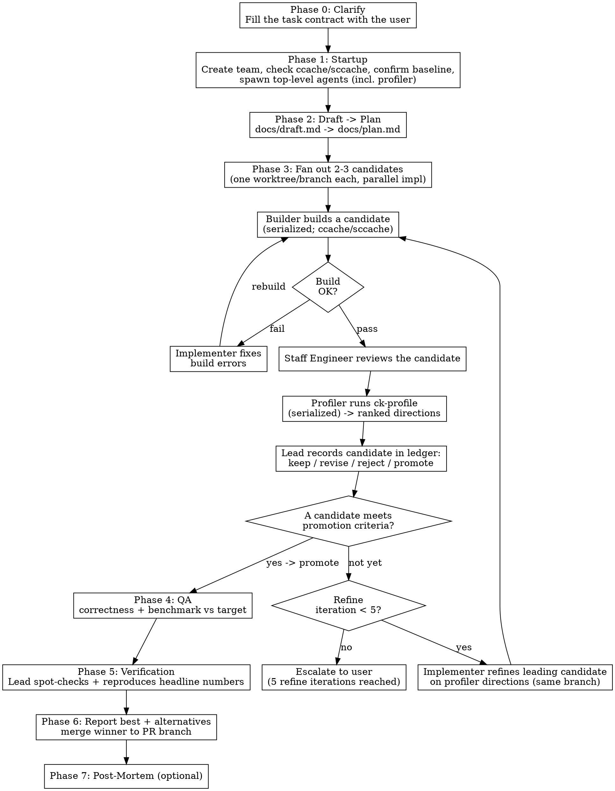

# Dev Team

## Overview

Orchestrate a hierarchical agent team that works like a thin, evidence-driven loop:
**clarify → draft → plan → fan out candidates → refine on profiling evidence →
report best + alternatives**. The lead (you, the current session) coordinates
specialized groups — researchers, implementers, reviewers, builder, profiler, and
QA — through eight phases (Phase 0–7): clarify, startup, draft-and-plan, the
candidate fan-out/refine loop, QA, verification, reporting, and post-mortem.

The defining shape: instead of producing one implementation, the team explores **2–3
distinct candidate implementations in parallel**, each in its own git worktree, then
**refines the leading candidate(s) using the profiler's ranked optimization
directions** until one meets the task contract's promotion criteria. The final
report presents the promoted candidate *and* the alternatives, with QA and profiling
evidence for each.

**Core principle:** Group leaders (professor, staff engineer, QA head) are both
participants and gatekeepers. They contribute their own expertise, aggregate group
input, and deliver a single consolidated response. No agent outside a group contacts
group members directly. The **profiler** is a standalone top-level role: it diagnoses
bottlenecks and recommends the next optimization, which the lead feeds back into the
candidate loop.

## When to Use

- Complex features requiring research, implementation, review, and testing
- Performance-sensitive code requiring benchmarking and profiling
- Tasks large enough to benefit from parallel research and implementation
- Work needing both correctness verification and performance validation

**Do not use for:** Single-file fixes, documentation updates, simple refactors, or tasks completable by one agent in a few iterations.

## Team Structure

```
Lead (you)
├── Implementer(s)         (one per active candidate, each in its own worktree)
├── Professor (research gatekeeper)
│   ├── PHD-1
│   ├── ...
│   └── PHD-N (1-5, decided by professor; PHDs can discuss with each other)
├── Staff Engineer (review gatekeeper)
│   ├── Senior-1
│   ├── ...
│   └── Senior-N (1-5, decided by staff engineer)
├── Builder                (serializes builds across candidate worktrees)
├── Profiler               (drives ck-profile; ranks next optimizations)
└── QA Head (test gatekeeper)
    ├── Tester-1
    ├── ...
    └── Tester-N
```

### Roles

| Agent | Responsibility | Spawned by | Contactable by |
|-------|---------------|------------|----------------|
| **Lead** | Run the contract→draft→plan→candidate-loop→report workflow, decompose the task, gate phase transitions, maintain the candidate ledger, compile the final report | User | Everyone |
| **Implementer** | Write code in an assigned candidate worktree, fix builder/review issues, refine the candidate on the profiler's directions. One implementer per active candidate; they work in parallel in separate worktrees | Lead | Lead, builder, staff-engineer, professor |
| **Professor** | Receive research questions from any agent. Route to PHDs, contribute own research, aggregate all opinions, deliver final answer. Professor makes the final call. | Lead | Any agent in the team |
| **PHD-1 ... N** | Answer research questions assigned by professor. Count and model mix decided by professor. PHDs can discuss findings with each other. | Professor | Professor and other PHDs |
| **Staff Engineer** | Review code personally, spawn and assign seniors (1-5, based on task scope), aggregate all feedback (including own), deliver consolidated feedback to implementer. Staff engineer makes the final call. Spawn with model: `opus`. | Lead | Lead, implementer |
| **Senior-1 ... N** | Review code assigned by staff engineer. Count and model mix decided by staff engineer (alternate `opus` and `sonnet` for diverse perspectives). | Staff Engineer | Staff engineer only |
| **Builder** | Build a candidate's code in its own worktree/build dir; builds are serialized across candidates; report errors/warnings to that candidate's implementer. Relies on a shared ccache/sccache so cold worktree builds stay cheap | Lead | Lead, implementer |
| **Profiler** | Profile a *built* candidate (drives `ck-profile` for CK/GPU work), diagnose the bottleneck, and return a ranked list of next optimizations. Profiles one candidate at a time (shared GPU). Standalone top-level role | Lead | Lead |
| **QA Head** | Receive task context from lead. Design test plan (or receive one from user via lead). Spawn testers, assign test tasks, aggregate results, report to lead. Owns correctness + benchmark-vs-target; defers bottleneck diagnosis and optimization search to the profiler. | Lead | Lead |
| **Tester-1 ... N** | Execute assigned tests, report results to QA head. Count decided by QA head. | QA Head | QA head only |

### Role Prompts

Each agent receives a role-specific prompt when spawned. Read the corresponding file from `roles/` and include its content in the Agent tool's `prompt` parameter:

```
roles/
  implementer.md
  professor.md
  phd.md
  staff-engineer.md
  senior-engineer.md
  builder.md
  profiler.md
  qa-head.md
  tester.md
```

Sub-leads (professor, staff engineer, QA head) read the role files for their group members and include them when spawning.

**Every spawn also carries a task brief.** The role file says *who the agent is*; the task brief says *what this specific assignment is*. Append a filled brief from `templates/task-brief.md` to the `prompt` of every Agent spawn (lead spawning top-level agents, and sub-leads spawning members). A brief states the objective, the expected output format, explicit boundaries (what not to touch), and done-criteria. Vague assignments are the largest single source of duplicated and misdirected work; the brief is the cheapest defense.

### Communication Rules

These are strict. Violating them defeats the purpose of the hierarchy.

- **Research group:** Only the professor is contactable from outside. PHDs can talk to the professor and to each other (peer discussion, debate). PHDs must not contact agents outside the research group.
- **Review group:** Only the staff engineer is contactable from outside. Seniors talk only to the staff engineer.
- **QA group:** Only the QA head is contactable from outside. Testers talk only to the QA head.
- **Professor is open:** Any agent can send research questions to the professor. This is the one cross-group channel.
- **Profiler ↔ lead only:** the profiler returns diagnoses and ranked optimization directions to the lead, which routes them to the relevant candidate's implementer. The profiler does not message implementers directly, and does not run correctness tests (that is QA).
- **The lead does NOT write code.** The implementer(s) write all code. The lead orchestrates.
- **Surface dissent, do not average it away.** When a sub-lead (professor, staff engineer, QA head) aggregates group input, it must report material disagreement to the requester, not just the synthesized verdict. Hiding a minority view that turns out correct is a coordination failure. State the majority position, the dissent, and why you ruled the way you did.

## File and Message Conventions

All files an agent writes (checkpoints, handoffs, reports, reviews) go under a single per-task directory:

```
.claude/.dev-team/<task_name>/<role>-<kind>.md
```

- `<task_name>` is a short slug the lead picks at startup (e.g. `fmha-backward`) and passes to every agent it spawns. Sub-leads pass it to their members.
- `<kind>` is `checkpoint`, `handoff`, `report`, `review`, `test-report`, or a topic slug (e.g. `professor-tiling-report.md`, `staff-engineer-review.md`, `implementer-checkpoint.md`).
- The lead ensures this directory is excluded from git at startup (see Phase 1). These are coordination scratch files, not deliverables — they must not enter the repo's git tree.

The lead-owned workflow files in this directory (built from the templates):

| File | Phase | Owner | Purpose |
|------|-------|-------|---------|
| `contract.md` | 0 | Lead | The task contract (`templates/task-contract.md`) — settled with the user before any work |
| `docs/draft.md` | 2 | Implementer | First plan draft: baseline, risks, candidate directions ranked by value/risk |
| `docs/plan.md` | 2 | Lead | The executable plan derived from the draft |
| `candidates.md` | 3+ | Lead | The candidate ledger (`templates/candidate-ledger.md`) — every candidate, its evidence, and the keep/revise/reject/promote decision |
| `profiler-<cand>-report.md` | 3 | Profiler | Per-candidate verdict + ranked optimization directions |

(All of these live under the coordination directory `.claude/.dev-team/<task_name>/`, including `docs/draft.md` and `docs/plan.md` — they are written in Phase 2 before any candidate worktree exists. The Phase 7 post-mortem is the exception: it is saved in the promoted candidate's worktree, which exists by then.)

**Artifact returns over chat returns.** Long outputs (a full consolidated review, a deep research report, a test report) are written to a file under the task directory. The producing agent then messages a path plus a summary of three lines or fewer, not the full text. Short, direct answers (a single spec value, a yes/no) go inline in the message. This keeps the lead's and sub-leads' context from filling with pasted reports.

## Workflow



### Phase 0: Clarify (task contract)

Before any tools, settle the **task contract** with the user. Iterate with
`AskUserQuestion` until every required field is concrete; do not start drafting or
spawning a team against an ambiguous request — that is the dominant cause of wasted
candidate builds.

1. Fill `templates/task-contract.md`: objective, inputs/outputs (incl. the specific
   representative shapes for a kernel), correctness requirements + **validation
   command**, **performance target** + **evaluation command**, constraints, and
   **promotion criteria**.
2. Establish the **baseline**: confirm the user has committed the PR branch to the
   point candidates should start from (uncommitted work is invisible to new
   worktrees). Record the baseline commit.
3. Write the result to `.claude/.dev-team/<task_name>/contract.md`.

For a small or fully-specified task, this is one quick round. Do not skip it — the
contract is what makes promotion decisions evidence-based later.

### Phase 1: Startup

1. Pick a short `<task_name>` slug (e.g. `fmha-backward`).
2. Create the team (`dev-team`).
3. **Check the build cache.** Confirm a shared compiler cache (ccache/sccache; CK supports
   it) is configured and points at a persistent dir. If absent, warn the user and
   **cap the fan-out at 2 candidates** — without a warm cache each candidate worktree
   pays a full cold build.
4. Exclude the coordination directory from git: add `.claude/.dev-team/` to
   `.git/info/exclude` if not already ignored. (`.git/info/exclude` is in the shared
   git dir, so it covers every worktree, and it is not a tracked file — nothing in
   the repo's git tree changes.) Create `.claude/.dev-team/<task_name>/`.
5. Spawn the top-level agents only: professor, staff-engineer, builder, **profiler**,
   qa-head (implementers are spawned per candidate in Phase 3). Pass each the
   `<task_name>` and the team name. **Do not spawn group members yet.**

**Candidate worktrees are created in Phase 3, not here.** There is no single global
worktree — each candidate gets its own (see "Candidate worktrees & build cache").

**Spawn group members lazily, not eagerly.** A crowd of idle agents burns tokens and
context; spawning too many up front is a top failure mode. Sub-leads spawn members
only when work arrives:
- **Professor** spawns PHDs on the first research question (count/model mix per the professor's sizing guidelines).
- **Staff engineer** spawns seniors when the first candidate build passes and review begins.
- **QA head** spawns testers in Phase 4.

A sub-lead with no incoming work stays a single agent.

### Phase 2: Draft → Plan

1. The lead has an implementer (with professor support) write
   `.claude/.dev-team/<task_name>/docs/draft.md` (no candidate worktree exists yet —
   these planning files live in the coordination directory): the baseline and how it
   is validated, the main risks/unknowns, **candidate implementation directions
   ranked by expected value and risk**, the first concrete steps, and the
   validation/evaluation commands from the contract.
2. The lead converts the draft into an executable
   `.claude/.dev-team/<task_name>/docs/plan.md` and picks the **2–3
   distinct candidate directions** to fan out (fewer if ccache/sccache is absent, or if disk
   for multiple CK build trees is tight).

Do not start implementing candidates until the plan names the directions and their
promotion evidence.

### Phase 3: Candidate fan-out + refine (max 5 refine iterations)

For each chosen direction, create a candidate:

1. **Worktree + branch.** Create a worktree on a `<pr-branch>-cand-X` branch cut from
   the baseline commit (a hyphen suffix, not `<pr-branch>/cand-X` — git cannot hold
   both a branch `feat/x` and a branch nested under `feat/x/`). Each worktree has its
   own `build/` and `ck_profile_out/`.
2. **Implement (parallel).** Spawn one implementer per candidate; they write in
   their own worktrees with zero file contention.
3. **Build + profile (serialized).** Process candidates one at a time through the
   shared builder and profiler — CK builds saturate CPU and the GPU/counters allow
   only one profiling run at a time:
   - **Builder** builds the candidate's worktree with `ckBuild` (the standard CK build
     command; its compiler cache keeps the cold build cheap). Build-fix retries with
     the implementer do not count as a refine iteration.
   - **Staff engineer** reviews the candidate (surfacing senior dissent).
   - **Profiler** runs `ck-profile` on the built candidate, diagnoses the bottleneck,
     and returns **ranked optimization directions** vs the baseline.
4. **Record + decide.** The lead writes a ledger row in `candidates.md` (status
   `keep`/`revise`/`reject`/`promote` with a reason and evidence pointers).
5. **Refine.** Send the profiler's top direction to the leading candidate's
   implementer; they refine on the **same `cand-X` branch** (a true incremental build
   in that worktree). Each implement→build→profile cycle that ends "not yet" is **one
   refine iteration**.

**Promotion rule:** promote a candidate only when it satisfies the contract's
promotion criteria with evidence (QA pass + profiler numbers that meet/improve the
target). Record the reason for every rejected candidate; never drop one silently.

If 5 refine iterations pass without a candidate meeting the criteria: **stop and
report to the user** with the ledger and the profiler history.

**The lead actively gates.** Do not rubber-stamp a staff-engineer approval or a
profiler "looks better" — read the review, the verdict, and the ledger, and judge
independently whether the promotion criteria are met.

### Phase 4: QA

1. Lead hands the QA head the contract, the promoted (and any surviving) candidate(s),
   and the validation/evaluation commands.
2. QA head designs (or receives) the test plan, spawns testers, runs **correctness**
   (unit/integration/edge) and **benchmark vs target**, plus compatibility/safety as
   the task warrants. Bottleneck diagnosis is the profiler's job, not QA's.
3. QA head aggregates and reports to the lead (path + summary), surfacing any
   contested/flaky result rather than smoothing it.

**If QA fails:** the lead sends the candidate back to Phase 3 (refine counter resets
for the new fix cycle) or reports to the user.

### Phase 5: Verification

Before reporting, the lead independently spot-checks:

1. Re-run or inspect 1–2 of QA's results directly.
2. Confirm the staff engineer's "approved" matches the promoted candidate's final
   diff (blockers resolved).
3. **Reproduce the promoted candidate's headline profiling numbers** — re-run the key
   ck-profile measurement and confirm it matches the profiler's report.
4. If any spot-check fails, return to Phase 3 (counter resets) or escalate.

**Do not skip this phase.** Testers produce false positives; reviewers miss late
regressions; a profiling number can be a fluke. Trust but verify.

### Phase 6: Report best + alternatives

Compile and present to the user, built from `candidates.md`:
- **Promoted candidate:** design and key decisions; build status; QA results
  (correctness + benchmark vs target); the profiler verdict and the **remaining
  ranked optimization directions**; verification results.
- **Alternatives:** each other candidate — its approach, QA + profiling result, and
  the recorded reason it was not promoted. This is the value of the fan-out; do not
  drop it.
- **Integration:** merge the promoted candidate's branch back onto the PR branch;
  remove the other candidate worktrees and branches. Note any unresolved issues or
  known limitations.

### Phase 7: Post-Mortem (optional)

After reporting, capture lessons for future invocations:

1. What went well? (e.g., a candidate direction paid off early; review caught a bug)
2. What went wrong? (e.g., a cold build blew the time budget; fan-out was too wide)
3. What to change next time? (e.g., narrow to 2 candidates; ask the professor about
   API compatibility before drafting)

Save to `docs/post-mortems/<date>-<topic>.md` in the promoted candidate's worktree.
The lead decides whether this phase runs — skip it for straightforward tasks.

## Quick Reference

| What | Who | Rule |
|------|-----|------|
| Settle the task contract | Lead ↔ User | Phase 0, `AskUserQuestion` until `contract.md` is complete; record the baseline commit |
| Spawn any agent | Lead / sub-leads | Append a filled `templates/task-brief.md` to the role prompt |
| Spawn group members | Sub-leads | Lazily, on first real work — not at startup |
| Return a long output | Producer | Write to `.claude/.dev-team/<task_name>/`, message path + ≤3-line summary |
| Aggregate group input | Sub-leads | Report dissent, not just the synthesized verdict |
| Ask a research question | Any agent → Professor | Professor routes to PHDs, aggregates, responds |
| Fan out candidates | Lead | 2–3 distinct directions, one worktree/branch each off the baseline (2 max without ccache/sccache) |
| Request code review | Lead → Staff Engineer | Staff engineer reviews + assigns seniors, aggregates, responds to implementer |
| Report build error | Builder → Implementer | Direct, no intermediary needed |
| Profile a candidate | Lead → Profiler | Profiler runs ck-profile (one candidate at a time), returns verdict + ranked directions |
| Record a candidate | Lead | One ledger row in `candidates.md`: keep/revise/reject/promote + reason + evidence |
| Design test plan | Lead → QA Head | QA head designs (or receives user's plan via lead); correctness + benchmark, not bottleneck analysis |
| Spawn testers | QA Head | QA head decides count and assignments |
| Gate promotion (Phase 3 → 4) | Lead | Lead judges promotion criteria from review + profiler + ledger, not a sub-lead's say-so |
| Verify before reporting | Lead | Spot-check 1–2 QA results AND reproduce the promoted candidate's headline profiling number |
| Report | Lead | Best candidate + alternatives from the ledger; merge winner, remove other worktrees |
| Post-mortem | Lead | Optional, for complex tasks. Save to docs/post-mortems/ |
| Escalate on iteration limit | Lead → User | After 5 refine iterations without meeting promotion criteria |

## Common Mistakes

**Flat team instead of hierarchy.** Without this skill, agents create 3-4 direct reports (one researcher, one tester, one reviewer). The skill requires group leaders with subordinates: professor + PHDs, staff engineer + seniors, QA head + testers.

**Eager spawning.** Spawning every PHD, senior, and tester at startup creates a crowd of idle agents that drain tokens and context before any work exists for them. Sub-leads spawn members only when work arrives (first research question, first passing build, Phase 3).

**Synthesizing away disagreement.** When a sub-lead aggregates, collapsing a real conflict into a clean verdict hides the signal the lead needs. Report the dissent alongside the decision.

**Pasting long reports into messages.** A full review or research report pasted into a message fills the recipient's context. Write it to a file under `.claude/.dev-team/<task_name>/` and send the path plus a short summary.

**Lead writes code.** The lead orchestrates. The implementer writes all code. If you find yourself editing files, stop — that is the implementer's job.

**Skipping the lead gate.** The lead independently judges whether a candidate meets the contract's promotion criteria — reading the review, the profiler verdict, and the ledger. Do not pass a staff-engineer approval or a profiler "looks better" straight through to promotion.

**Skipping the contract.** Jumping to implementation without a settled Phase 0 contract (validation command, target, promotion criteria, baseline) is the dominant cause of wasted candidate builds. One quick clarification round is cheap; a wrong fan-out is not.

**Direct contact with group members.** The implementer must not message PHDs or seniors directly. All cross-group requests go through the group leader (professor or staff engineer). The profiler talks only to the lead.

**Shutting down researchers early.** Keep the research group alive throughout the candidate loop. An implementer or the profiler may need research help at any point, not just at the start.

**One shared build/profile for parallel candidates.** Candidates each get their own worktree, but build and profile are serialized — two CK builds saturate the host and two profiling runs contend for the GPU/counters. Never build or profile two candidates at once.

**Copying `build/` between worktrees.** `build/` is gitignored, so a new worktree starts cold; copying a built tree across worktrees breaks because CMake/Ninja bake in absolute paths. Rely on a shared **ccache/sccache** instead (warm cache → cheap cold builds). Refining a candidate *in its own worktree* is a genuine incremental build.

**Eager fan-out without a cache.** Without ccache/sccache, each candidate pays a full cold build and N build trees eat disk. Cap the fan-out at 2 and warn the user.

**Losing the alternatives.** The point of the fan-out is the comparison. Record every candidate's outcome and rejection reason in `candidates.md`, and report the alternatives alongside the winner — do not silently drop them.

## Candidate worktrees & build cache

The fan-out runs on one git worktree per candidate. A worktree is a full,
independent on-disk checkout sharing the same `.git` object store.

- **One branch + one build per candidate.** Each candidate is a `<pr-branch>-cand-X`
  branch (hyphen suffix — `<pr-branch>/cand-X` would collide with the PR branch's own
  ref) cut from the **baseline commit**, checked out in its own worktree with its
  own `build/` and `ck_profile_out/`. Git enforces one branch per worktree, which is
  exactly one branch per candidate. Implementers edit in parallel with zero file
  contention — even the same path is a different file in each worktree.
- **Baseline must be committed.** Worktrees branch from committed state; any
  uncommitted work on the PR branch is invisible to new worktrees. Phase 0 confirms
  the user has committed the baseline so every candidate starts identical.
- **`build/` is not copied.** It is gitignored, so each worktree starts with no
  `build/` and its first build is a **cold full build**. Do not copy a built tree
  between worktrees — CMake/Ninja bake in absolute paths and it will reconfigure
  anyway.
- **Build with `ckBuild`; the shared cache makes cold builds cheap.** `ckBuild` is the
  standard CK build command (`REPO=<worktree> ckBuild <target>`); on a first/scratch
  configure it adds a compiler-launcher (prefers ccache, falls back to sccache)
  pointed at one persistent cache dir. The user's pre-build warms it, so each
  candidate's cold build reuses cached objects. Refining a candidate **in place** in
  its own worktree is a true incremental build — only the first build per candidate is
  cold.
- **Serialize the shared stages.** Implementation is parallel; **build and profile
  are queued** (CPU saturation; one GPU profiling run at a time). Disk for N CK build
  trees and cold-build time bound how wide the fan-out can go — 2–3 with ccache/sccache,
  2 without.
- **`ck_profile_out/` stays out of git** automatically: `ck-profile` adds it to the
  shared `.git/info/exclude`, which covers every worktree.
- **Integration:** the promoted candidate's branch merges back onto the PR branch
  (clean, since all candidates share its ancestor); the other worktrees and branches
  are removed in Phase 6.

## Context Management

Long-running agents will exhaust their context window. Three mechanisms prevent context loss: a checkpoint, a pre-operation check, and a handoff. All use the template in `templates/context-checkpoint.md`. Read it before writing your first checkpoint.

### 60% Checkpoint (scratchpad)

When context usage reaches ~60% remaining, the agent writes a checkpoint without requesting replacement:
1. Read `templates/context-checkpoint.md` for the template.
2. Copy the template into `.claude/.dev-team/<task_name>/<role>-checkpoint.md`. Fill in the common sections and your role-specific section. Set **Type** to `checkpoint`.
3. Continue working. Do not message the lead or sub-lead.

This creates a recovery point in case the agent crashes or gets stuck. The checkpoint file is available to the replacement agent if a handoff becomes necessary later.

### Check before heavy operations

After writing the 60% checkpoint, check context usage before every heavy operation: reading large files, generating long code blocks, or running tools that produce verbose output. If context remaining is below 40%, skip the operation and proceed directly to the handoff below.

This prevents blowing past the handoff threshold in a single operation. A large file read or code generation can consume 10-15% of context in one turn.

### 40% Handoff (ask-first)

When context usage reaches ~40% remaining, the agent stops current work and initiates a full handoff:
1. Read `templates/context-checkpoint.md` for the template.
2. Copy the template into `.claude/.dev-team/<task_name>/<role>-handoff.md`. Fill in all sections, including **Work remaining** and **Blockers**. Set **Type** to `handoff`. Reference the earlier checkpoint file if one exists.
3. Message your direct lead with the file path and ask for a replacement:
   - Group members (PHDs, seniors, testers) → their sub-lead (professor, staff engineer, QA head)
   - Top-level agents (implementers, professor, staff engineer, builder, profiler, QA head) → the lead
4. The lead/sub-lead reviews the handoff, spawns a fresh agent with the same role prompt plus the handoff summary appended, and shuts down the old agent.

**The agent does not self-replace.** It asks and waits. The lead/sub-lead decides when to perform the swap.
