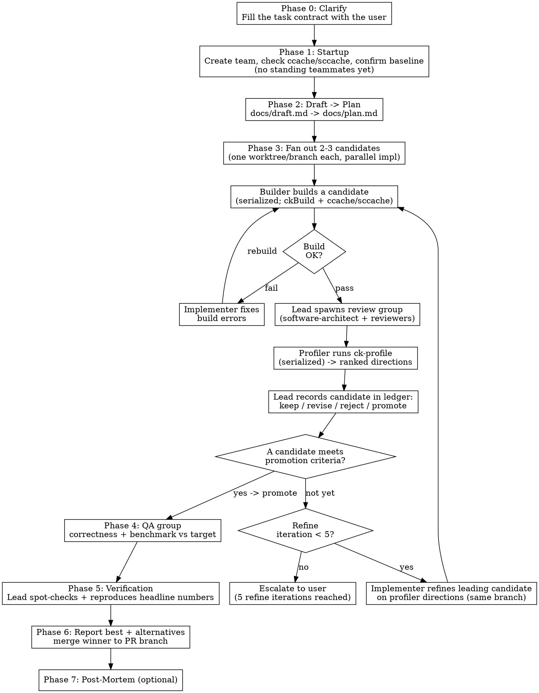

# Dev Team

## Overview

Orchestrate an agent team that works like a thin, evidence-driven loop:
**clarify → draft → plan → fan out candidates → refine on profiling evidence →
report best + alternatives**. The lead (you, the current session) is the only agent
that spawns or stops teammates; it coordinates specialized workers and groups —
researchers, implementers, reviewers, builder, profiler, and testers — through eight
phases (Phase 0–7): clarify, startup, draft-and-plan, the candidate fan-out/refine
loop, QA, verification, reporting, and post-mortem.

The defining shape: instead of producing one implementation, the team explores **2–3
distinct candidate implementations in parallel**, each in its own git worktree, then
**refines the leading candidate(s) using the profiler's ranked optimization
directions** until one meets the task contract's promotion criteria. The final
report presents the promoted candidate *and* the alternatives, with QA and profiling
evidence for each.

**Core principles:**
- **The lead owns lifecycle; teammates own the message bus.** Only the lead can
  spawn or stop a teammate (a teammate has no Agent tool and cannot spawn anything).
  Results flow peer-to-peer — teammates hand their output directly to whoever needs
  it, not back through the lead.
- **Spawn on demand, stop on delivery.** The lead spawns a worker or group only when
  its work exists and stops it once it has delivered, keeping the number of live
  teammates small. A crowd of idle teammates is the top failure mode.
- **Groups synthesize through a coordinator.** A research/review/QA group's workers
  investigate and debate each other, then hand findings to their coordinator
  (principal-researcher, software-architect, test-architect), who delivers one
  consolidated, dissent-aware result to the requester.

## When to Use

- Complex features requiring research, implementation, review, and testing
- Performance-sensitive code requiring benchmarking and profiling
- Tasks large enough to benefit from parallel research and implementation
- Work needing both correctness verification and performance validation

**Do not use for:** Single-file fixes, documentation updates, simple refactors, or tasks completable by one agent in a few iterations.

## Team Structure

The lead is the only agent that spawns or stops teammates. The grouping below is
logical (who synthesizes whose output), **not** a spawn hierarchy — every teammate,
worker and coordinator alike, is spawned directly by the lead.

```
Lead (you, the main session) — sole spawner/stopper; spawns on demand, stops on delivery

Worker teammates — native agent definitions in ~/.claude/agents/
(each reusable as a one-shot delegated subagent OR as a team teammate):
  implementer   one per active candidate, each in its own worktree
  researcher    investigates + debates peers, hands findings to principal-researcher
  reviewer      reviews a diff, hands findings to software-architect
  tester        authors/runs tests, hands results to test-architect
  builder       serializes candidate builds (singleton)
  profiler      drives ck-profile, ranks next optimizations (singleton)

Coordinator teammates — role prompts in roles/ (team-only; coordinate by
messaging, they do NOT spawn — the lead spawns the whole group at once):
  principal-researcher   synthesizes the research group's conclusion
  software-architect     synthesizes the review group's consolidated review
  test-architect         synthesizes the QA group's test report
```

### Roles

Every teammate is spawned and stopped by the **lead**.

| Agent | Kind | Responsibility | Hands results to |
|-------|------|---------------|------------------|
| **Lead** | main session | Run the contract→draft→plan→candidate-loop→report workflow, spawn/stop every teammate, gate phase transitions, maintain the candidate ledger, compile the final report | the user |
| **implementer** | native agent | Write code in an assigned candidate worktree, fix builder/review issues, refine the candidate on the profiler's directions. One implementer per active candidate; they work in parallel in separate worktrees | reviewer group; lead (status) |
| **researcher** | native agent | Investigate a research question (web + codebase), debate peers to stress-test conclusions | principal-researcher |
| **principal-researcher** | role prompt | Frame the questions, synthesize the researchers' findings into one conclusion, report dissent | the requester (e.g. implementer) |
| **reviewer** | native agent | Review code against the checklist, return severity-prefixed findings | software-architect |
| **software-architect** | role prompt | Review personally, assign reviewers to domains, synthesize one consolidated review, report dissent | the implementer |
| **builder** | native agent | Build a candidate's worktree with `ckBuild` (serialized across candidates), report errors/warnings | the implementer |
| **profiler** | native agent | Profile a *built* candidate (drives `ck-profile`), diagnose the bottleneck, return ranked next optimizations. One candidate at a time | the requester (implementer) + lead |
| **test-architect** | role prompt | Design/receive the test plan, synthesize tester results, benchmark vs target. Owns correctness + benchmark; defers bottleneck diagnosis to the profiler | the lead |
| **tester** | native agent | Author/execute assigned tests and benchmarks, report pass/fail with evidence | test-architect |

### Agent types and role prompts

**Worker roles are native subagent definitions** in `~/.claude/agents/` (symlinked
from the repo's `agents/` by `setup.sh`): `implementer`, `researcher`, `reviewer`,
`tester`, `builder`, `profiler`. Each is reusable two ways:

- as a one-shot **delegated subagent** — the lead delegates a task and gets the
  result back, with no standing teammate (cheapest, most controlled); or
- as a **team teammate** — spawned into the team by its agent type, which adds the
  team-coordination tools (`SendMessage`, task tools) on top of the definition's
  `tools` and `model`, with the definition's body appended to the system prompt.

Use a delegated subagent when only the result matters; spawn teammates when workers
must talk to each other (debate, parallel candidate ownership).

**Coordinator roles are dev-team-specific prompts** in `roles/`:
`principal-researcher.md`, `software-architect.md`, `test-architect.md`. They are
team-only (a coordinator has nothing to coordinate as a one-shot subagent). The lead
reads the role file and includes it when spawning the coordinator.

**Skills in teammate mode:** a subagent definition's `skills:` field is applied only
when it runs as a *delegated subagent*; a *teammate* loads skills from project/user
settings like a normal session. The `researcher` and `profiler` bodies therefore
also name the skill to apply (`research`, `ck-profile`), so they work both ways.

**Every spawn carries a task brief.** The agent definition or role file says *who the
agent is*; the task brief says *what this specific assignment is*. Append a filled
brief from `templates/task-brief.md` to the `prompt` of every spawn. A brief states
the objective, the expected output format, explicit boundaries (what not to touch),
and done-criteria. Vague assignments are the largest single source of duplicated and
misdirected work; the brief is the cheapest defense.

### Communication Rules

These are strict. Violating them defeats the purpose of the team.

- **The lead owns lifecycle; teammates own the message bus.** Only the lead spawns
  or stops a teammate. Results flow peer-to-peer: teammates message each other
  directly by name and do not relay output through the lead.
- **Need a service? Ask the lead to spawn it.** When a teammate needs research,
  review, a build, profiling, or testing it cannot do itself, it messages the lead.
  The lead spawns the right worker or group; the provider delivers its result
  **directly to the requester**, then tells the lead it is done so the lead stops
  it. Spawn on demand, stop on delivery.
- **Groups synthesize through their coordinator.** In a research/review/QA group the
  workers investigate and debate each other, then hand findings to the coordinator
  (principal-researcher / software-architect / test-architect). The coordinator
  synthesizes one conclusion and delivers it to the requester.
- **Surface dissent, do not average it away.** A coordinator must report material
  disagreement to the requester, not just the synthesized verdict. State the majority
  position, the dissent, and why you ruled the way you did.
- **The lead does NOT write code.** The implementer(s) write all code. The lead
  orchestrates.

## File and Message Conventions

All files an agent writes (checkpoints, handoffs, reports, reviews) go under a single per-task directory:

```
.claude/.dev-team/<task_name>/<role>-<kind>.md
```

- `<task_name>` is a short slug the lead picks at startup (e.g. `fmha-backward`) and passes to every agent it spawns.
- `<kind>` is `checkpoint`, `handoff`, `report`, `review`, `test-report`, or a topic slug (e.g. `software-architect-review.md`, `test-architect-test-report.md`, `implementer-checkpoint.md`).
- The lead ensures this directory is excluded from git at startup (see Phase 1). These are coordination scratch files, not deliverables — they must not enter the repo's git tree.

The lead-owned workflow files in this directory (built from the templates):

| File | Phase | Owner | Purpose |
|------|-------|-------|---------|
| `contract.md` | 0 | Lead | The task contract (`templates/task-contract.md`) — settled with the user before any work |
| `docs/draft.md` | 2 | Implementer | First plan draft: baseline, risks, candidate directions ranked by value/risk |
| `docs/plan.md` | 2 | Lead | The executable plan derived from the draft |
| `candidates.md` | 3+ | Lead | The candidate ledger (`templates/candidate-ledger.md`) — every candidate, its evidence, and the keep/revise/reject/promote decision |
| `profiler-<cand>-report.md` | 3 | Profiler | Per-candidate verdict + ranked optimization directions |

(All of these live under the coordination directory `.claude/.dev-team/<task_name>/`, including `docs/draft.md` and `docs/plan.md` — they are written in Phase 2 before any candidate worktree exists. The Phase 7 post-mortem is the exception: it is saved in the promoted candidate's worktree, which exists by then.)

**Artifact returns over chat returns.** Long outputs (a full consolidated review, a deep research report, a test report) are written to a file under the task directory. The producing agent then messages a path plus a summary of three lines or fewer, not the full text. Short, direct answers (a single spec value, a yes/no) go inline in the message. This keeps recipients' context from filling with pasted reports.

## Workflow



### Lead orchestration skills

The lead drives the workflow with these skills — lead-level patterns, not
worker-agent skills (worker agents reference their own skills in their definitions):

- `superpowers:writing-plans` / `superpowers:executing-plans` — Phase 2 draft→plan
  and running the plan across candidates.
- `superpowers:using-git-worktrees` — Phase 3 candidate worktrees.
- `superpowers:dispatching-parallel-agents` — Phase 3 parallel implementers.
- `superpowers:requesting-code-review` — Phase 3, spawning the review group on a
  passing build.
- `superpowers:verification-before-completion` — Phase 5 verification.
- `superpowers:finishing-a-development-branch` — Phase 6 integration (merge the
  winner, remove the other worktrees and branches).

### Phase 0: Clarify (task contract)

Before any tools, settle the **task contract** with the user. Iterate with
`AskUserQuestion` until every required field is concrete; do not start drafting or
spawning a team against an ambiguous request — that is the dominant cause of wasted
candidate builds.

1. Fill `templates/task-contract.md`: objective, inputs/outputs (incl. the specific
   representative shapes for a kernel), correctness requirements + **validation
   command**, **performance target** + **evaluation command**, constraints, and
   **promotion criteria**.
2. Establish the **baseline**: confirm the user has committed the PR branch to the
   point candidates should start from (uncommitted work is invisible to new
   worktrees). Record the baseline commit.
3. Write the result to `.claude/.dev-team/<task_name>/contract.md`.

For a small or fully-specified task, this is one quick round. Do not skip it — the
contract is what makes promotion decisions evidence-based later.

### Phase 1: Startup

1. Pick a short `<task_name>` slug (e.g. `fmha-backward`).
2. Create the team (`dev-team`).
3. **Check the build cache.** Confirm a shared compiler cache (ccache/sccache; CK supports
   it) is configured and points at a persistent dir. If absent, warn the user and
   **cap the fan-out at 2 candidates** — without a warm cache each candidate worktree
   pays a full cold build.
4. Exclude the coordination directory from git: add `.claude/.dev-team/` to
   `.git/info/exclude` if not already ignored. (`.git/info/exclude` is in the shared
   git dir, so it covers every worktree, and it is not a tracked file — nothing in
   the repo's git tree changes.) Create `.claude/.dev-team/<task_name>/`.
5. **Hold a GPU if runs go through Slurm.** When profiling and benchmarks dispatch
   via Slurm (`ckRun`/`ck-profile` detect `srun`), start one persistent holder now —
   `ckHold --arch <gfx>` — so every Phase 3 profile and Phase 4 benchmark overlaps
   into the held node instantly instead of re-queuing an allocation per run across N
   candidates × refine iterations. Stop it in Phase 6 with `ckHold stop`. Skip on a
   direct/docker host.
6. **Spawn no teammates yet.** Unlike a fixed org chart, the lead spawns workers and
   groups on demand in later phases and stops them once they deliver. There is no
   standing team to staff at startup.

**Candidate worktrees are created in Phase 3, not here.** There is no single global
worktree — each candidate gets its own (see "Candidate worktrees & build cache").

**Spawn on demand, stop on delivery.** This is the rule that keeps the team
controllable:
- A **research** need (Phase 2 drafting, or any later point) → the lead spawns a
  research group (principal-researcher + the researchers it needs), which delivers
  the conclusion to the requester and is then stopped.
- A **passing build** → the lead spawns a review group (software-architect +
  reviewers), which delivers the consolidated review to the implementer and is then
  stopped.
- **Phase 4** → the lead spawns the QA group (test-architect + testers), which
  delivers the report and is then stopped.
- **builder** and **profiler** are serialized singletons; the lead may keep one of
  each alive across Phase 3 rather than respawn per candidate. **implementers**
  persist per candidate through refinement.

A teammate that needs help it cannot provide asks the lead — it cannot spawn anyone
itself.

### Phase 2: Draft → Plan

1. The lead spawns an **implementer** to write
   `.claude/.dev-team/<task_name>/docs/draft.md` (no candidate worktree exists yet —
   these planning files live in the coordination directory): the baseline and how it
   is validated, the main risks/unknowns, **candidate implementation directions
   ranked by expected value and risk**, the first concrete steps, and the
   validation/evaluation commands from the contract. If the implementer needs
   research, it asks the lead, which spawns a research group; the
   principal-researcher delivers the findings to the implementer, and the lead stops
   the group.
2. The lead converts the draft into an executable
   `.claude/.dev-team/<task_name>/docs/plan.md` and picks the **2–3
   distinct candidate directions** to fan out (fewer if ccache/sccache is absent, or if disk
   for multiple CK build trees is tight).

Do not start implementing candidates until the plan names the directions and their
promotion evidence.

### Phase 3: Candidate fan-out + refine (max 5 refine iterations)

For each chosen direction, create a candidate:

1. **Worktree + branch.** Create a worktree on a `<pr-branch>-cand-X` branch cut from
   the baseline commit (a hyphen suffix, not `<pr-branch>/cand-X` — git cannot hold
   both a branch `feat/x` and a branch nested under `feat/x/`). Each worktree has its
   own `build/` and `ck_profile_out/`.
2. **Implement (parallel).** The lead spawns one implementer per candidate; they
   write in their own worktrees with zero file contention.
3. **Build + review + profile (serialized).** Process candidates one at a time
   through the shared builder and profiler — CK builds saturate CPU and the
   GPU/counters allow only one profiling run at a time:
   - **builder** builds the candidate's worktree with `ckBuild` (the standard CK
     build command; its compiler cache keeps the cold build cheap) and reports errors
     directly to that candidate's implementer. Build-fix retries do not count as a
     refine iteration.
   - When the build passes, the lead spawns the **review group**
     (software-architect + reviewers); the software-architect delivers the
     consolidated review (with dissent) to the implementer, and the lead stops the
     group.
   - **profiler** runs `ck-profile` on the built candidate, diagnoses the
     bottleneck, and delivers **ranked optimization directions** vs the baseline to
     the implementer (and the lead).
4. **Record + decide.** The lead writes a ledger row in `candidates.md` (status
   `keep`/`revise`/`reject`/`promote` with a reason and evidence pointers).
5. **Refine.** The leading candidate's implementer refines on the profiler's top
   direction, on the **same `cand-X` branch** (a true incremental build in that
   worktree). Each implement→build→profile cycle that ends "not yet" is **one refine
   iteration**.

**Promotion rule:** promote a candidate only when it satisfies the contract's
promotion criteria with evidence (QA pass + profiler numbers that meet/improve the
target). Record the reason for every rejected candidate; never drop one silently.

If 5 refine iterations pass without a candidate meeting the criteria: **stop and
report to the user** with the ledger and the profiler history.

**The lead actively gates.** Do not rubber-stamp a software-architect approval or a
profiler "looks better" — read the review, the verdict, and the ledger, and judge
independently whether the promotion criteria are met.

### Phase 4: QA

1. The lead spawns the **QA group** (test-architect + testers) and hands the
   test-architect the contract, the promoted (and any surviving) candidate(s), and
   the validation/evaluation commands.
2. The test-architect designs (or receives) the test plan, has the testers run
   **correctness** (unit/integration/edge) and **benchmark vs target**, plus
   compatibility/safety as the task warrants. Bottleneck diagnosis is the profiler's
   job, not QA's.
3. The test-architect aggregates and delivers the report to the lead (path +
   summary), surfacing any contested/flaky result rather than smoothing it. The lead
   then stops the QA group.

**If QA fails:** the lead sends the candidate back to Phase 3 (refine counter resets
for the new fix cycle) or reports to the user.

### Phase 5: Verification

Before reporting, the lead independently spot-checks:

1. Re-run or inspect 1–2 of QA's results directly.
2. Confirm the software-architect's "approved" matches the promoted candidate's final
   diff (blockers resolved).
3. **Reproduce the promoted candidate's headline profiling numbers** — re-run the key
   ck-profile measurement and confirm it matches the profiler's report.
4. If any spot-check fails, return to Phase 3 (counter resets) or escalate.

**Do not skip this phase.** Testers produce false positives; reviewers miss late
regressions; a profiling number can be a fluke. Trust but verify.

### Phase 6: Report best + alternatives

Compile and present to the user, built from `candidates.md`:
- **Promoted candidate:** design and key decisions; build status; QA results
  (correctness + benchmark vs target); the profiler verdict and the **remaining
  ranked optimization directions**; verification results.
- **Alternatives:** each other candidate — its approach, QA + profiling result, and
  the recorded reason it was not promoted. This is the value of the fan-out; do not
  drop it.
- **Integration:** merge the promoted candidate's branch back onto the PR branch;
  remove the other candidate worktrees and branches. Note any unresolved issues or
  known limitations.

### Phase 7: Post-Mortem (optional)

After reporting, capture lessons for future invocations:

1. What went well? (e.g., a candidate direction paid off early; review caught a bug)
2. What went wrong? (e.g., a cold build blew the time budget; fan-out was too wide)
3. What to change next time? (e.g., narrow to 2 candidates; spawn a research group to
   check API compatibility before drafting)

Save to `docs/post-mortems/<date>-<topic>.md` in the promoted candidate's worktree.
The lead decides whether this phase runs — skip it for straightforward tasks.

## Quick Reference

| What | Who | Rule |
|------|-----|------|
| Settle the task contract | Lead ↔ User | Phase 0, `AskUserQuestion` until `contract.md` is complete; record the baseline commit |
| Spawn / stop any teammate | Lead only | On demand, stopped after it delivers; teammates cannot spawn anyone |
| Spawn any agent | Lead | Reference the agent type (worker) or read the role file (coordinator); append a filled `templates/task-brief.md` |
| Return a long output | Producer | Write to `.claude/.dev-team/<task_name>/`, message path + ≤3-line summary |
| Aggregate group input | Coordinator | Report dissent, not just the synthesized verdict |
| Get research | Any agent → Lead | Lead spawns a research group (principal-researcher + researchers); they deliver to the requester, then the lead stops them |
| Fan out candidates | Lead | 2–3 distinct directions, one worktree/branch each off the baseline (2 max without ccache/sccache) |
| Build / run a candidate | builder / tester | `ckBuild` to build, `ckRun --arch <gfx>` to run or benchmark on a GPU (never hand-roll cmake/ninja) |
| Hold a GPU for fast runs | Lead | `ckHold --arch <gfx>` at startup when runs go through Slurm; `ckHold stop` in Phase 6 |
| Request code review | Lead | On a passing build, spawn software-architect + reviewers; they deliver the review to the implementer; lead stops them |
| Report build error | builder → implementer | Direct, no intermediary |
| Profile a candidate | Lead → profiler | Profiler runs ck-profile (one candidate at a time), delivers verdict + ranked directions to the implementer |
| Record a candidate | Lead | One ledger row in `candidates.md`: keep/revise/reject/promote + reason + evidence |
| Run QA | Lead → test-architect | Spawn QA group in Phase 4; correctness + benchmark vs target, not bottleneck analysis; lead stops them after the report |
| Gate promotion (Phase 3 → 4) | Lead | Lead judges promotion criteria from review + profiler + ledger, not a coordinator's say-so |
| Verify before reporting | Lead | Spot-check 1–2 QA results AND reproduce the promoted candidate's headline profiling number |
| Report | Lead | Best candidate + alternatives from the ledger; merge winner, remove other worktrees |
| Post-mortem | Lead | Optional, for complex tasks. Save to docs/post-mortems/ |
| Escalate on iteration limit | Lead → User | After 5 refine iterations without meeting promotion criteria |

## Common Mistakes

**A teammate trying to spawn its own helpers.** Teammates have no Agent tool and
cannot spawn anyone — not even a coordinator spawning its own group. If a worker or
coordinator needs more hands, it asks the lead; only the lead spawns.

**Spawning everyone up front.** Staffing a full org chart at startup creates a crowd
of idle teammates that drain tokens and become uncontrollable. Spawn a worker or
group only when its work exists, and stop it once it has delivered.

**Relaying results through the lead.** Results flow peer-to-peer — a provider hands
its output straight to the requester (researchers → implementer, builder →
implementer, software-architect → implementer). The lead controls spawn/stop, not
the message bus.

**Leaving a group alive after it delivers.** Once a research/review/QA group hands
off its result, the coordinator tells the lead so it stops the group. A group left
running burns context for nothing.

**Synthesizing away disagreement.** When a coordinator aggregates, collapsing a real
conflict into a clean verdict hides the signal the requester needs. Report the
dissent alongside the decision.

**Pasting long reports into messages.** A full review or research report pasted into
a message fills the recipient's context. Write it to a file under
`.claude/.dev-team/<task_name>/` and send the path plus a short summary.

**Lead writes code.** The lead orchestrates. The implementer writes all code. If you
find yourself editing files, stop — that is the implementer's job.

**Skipping the lead gate.** The lead independently judges whether a candidate meets
the contract's promotion criteria — reading the review, the profiler verdict, and the
ledger. Do not pass a software-architect approval or a profiler "looks better"
straight through to promotion.

**Skipping the contract.** Jumping to implementation without a settled Phase 0
contract (validation command, target, promotion criteria, baseline) is the dominant
cause of wasted candidate builds. One quick clarification round is cheap; a wrong
fan-out is not.

**One shared build/profile for parallel candidates.** Candidates each get their own
worktree, but build and profile are serialized — two CK builds saturate the host and
two profiling runs contend for the GPU/counters. Never build or profile two
candidates at once.

**Copying `build/` between worktrees.** `build/` is gitignored, so a new worktree
starts cold; copying a built tree across worktrees breaks because CMake/Ninja bake in
absolute paths. Rely on a shared **ccache/sccache** instead (warm cache → cheap cold
builds). Refining a candidate *in its own worktree* is a genuine incremental build.

**Eager fan-out without a cache.** Without ccache/sccache, each candidate pays a full
cold build and N build trees eat disk. Cap the fan-out at 2 and warn the user.

**Losing the alternatives.** The point of the fan-out is the comparison. Record every
candidate's outcome and rejection reason in `candidates.md`, and report the
alternatives alongside the winner — do not silently drop them.

## Candidate worktrees & build cache

The fan-out runs on one git worktree per candidate. A worktree is a full,
independent on-disk checkout sharing the same `.git` object store.

- **One branch + one build per candidate.** Each candidate is a `<pr-branch>-cand-X`
  branch (hyphen suffix — `<pr-branch>/cand-X` would collide with the PR branch's own
  ref) cut from the **baseline commit**, checked out in its own worktree with its
  own `build/` and `ck_profile_out/`. Git enforces one branch per worktree, which is
  exactly one branch per candidate. Implementers edit in parallel with zero file
  contention — even the same path is a different file in each worktree.
- **Baseline must be committed.** Worktrees branch from committed state; any
  uncommitted work on the PR branch is invisible to new worktrees. Phase 0 confirms
  the user has committed the baseline so every candidate starts identical.
- **`build/` is not copied.** It is gitignored, so each worktree starts with no
  `build/` and its first build is a **cold full build**. Do not copy a built tree
  between worktrees — CMake/Ninja bake in absolute paths and it will reconfigure
  anyway.
- **Build with `ckBuild`; the shared cache makes cold builds cheap.** `ckBuild` is the
  standard CK build command (`REPO=<worktree> ckBuild <target>`); on a first/scratch
  configure it adds a compiler-launcher (prefers ccache, falls back to sccache)
  pointed at one persistent cache dir. The user's pre-build warms it, so each
  candidate's cold build reuses cached objects. Refining a candidate **in place** in
  its own worktree is a true incremental build — only the first build per candidate is
  cold.
- **Serialize the shared stages.** Implementation is parallel; **build and profile
  are queued** (CPU saturation; one GPU profiling run at a time). Disk for N CK build
  trees and cold-build time bound how wide the fan-out can go — 2–3 with ccache/sccache,
  2 without.
- **Run on GPU with `ckRun`; hold one with `ckHold`.** `ckRun`
  (`REPO=<worktree> ckRun --arch <gfx> <cmd>`) dispatches a built binary to a GPU
  (srun/docker/direct auto-detected). When runs go through Slurm, `ckHold` grabs one
  GPU node up front so every candidate's profile and benchmark overlaps into it
  instantly rather than re-queuing per run.
- **`ck_profile_out/` stays out of git** automatically: `ck-profile` adds it to the
  shared `.git/info/exclude`, which covers every worktree.
- **Integration:** the promoted candidate's branch merges back onto the PR branch
  (clean, since all candidates share its ancestor); the other worktrees and branches
  are removed in Phase 6.

## Context Management

Long-running agents will exhaust their context window. Three mechanisms prevent context loss: a checkpoint, a pre-operation check, and a handoff. All use the template in `templates/context-checkpoint.md`. Read it before writing your first checkpoint.

### 60% Checkpoint (scratchpad)

When context usage reaches ~60% remaining, the agent writes a checkpoint without requesting replacement:
1. Read `templates/context-checkpoint.md` for the template.
2. Copy the template into `.claude/.dev-team/<task_name>/<role>-checkpoint.md`. Fill in the common sections and your role-specific section. Set **Type** to `checkpoint`.
3. Continue working. Do not message the lead.

This creates a recovery point in case the agent crashes or gets stuck. The checkpoint file is available to the replacement agent if a handoff becomes necessary later.

### Check before heavy operations

After writing the 60% checkpoint, check context usage before every heavy operation: reading large files, generating long code blocks, or running tools that produce verbose output. If context remaining is below 40%, skip the operation and proceed directly to the handoff below.

This prevents blowing past the handoff threshold in a single operation. A large file read or code generation can consume 10-15% of context in one turn.

### 40% Handoff (ask-first)

When context usage reaches ~40% remaining, the agent stops current work and initiates a full handoff:
1. Read `templates/context-checkpoint.md` for the template.
2. Copy the template into `.claude/.dev-team/<task_name>/<role>-handoff.md`. Fill in all sections, including **Work remaining** and **Blockers**. Set **Type** to `handoff`. Reference the earlier checkpoint file if one exists.
3. Message the **lead** with the file path and ask for a replacement. (The lead spawned every teammate and is the only agent that can spawn the replacement — so every handoff goes to the lead, whether you are a worker or a coordinator.)
4. The lead reviews the handoff, spawns a fresh agent with the same role plus the handoff summary appended, and stops the old agent.

**The agent does not self-replace.** It asks and waits. The lead decides when to perform the swap.
